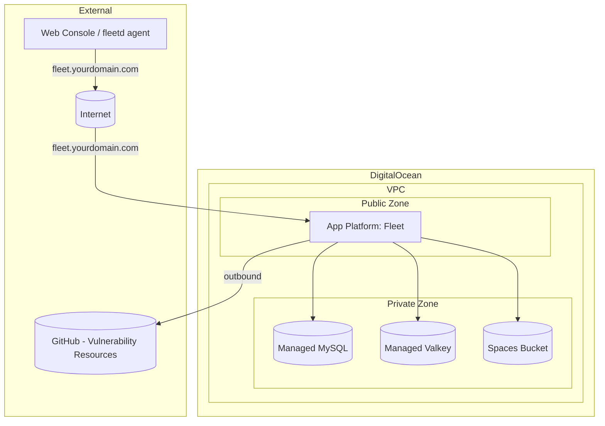

# Terraform DigitalOcean Fleet Deployment

This Terraform project automates the deployment of Fleet Device Management (Fleet) on DigitalOcean. It provisions all infrastructure components using DigitalOcean's managed services:

* **App Platform** — Runs the Fleet application container (equivalent to AWS ECS or GCP Cloud Run)
* **Managed MySQL** — Database for Fleet (equivalent to AWS Aurora or GCP Cloud SQL)
* **Managed Valkey** — Redis-compatible cache (equivalent to AWS ElastiCache or GCP Memorystore)
* **Spaces** — S3-compatible object storage for software installers (equivalent to AWS S3 or GCP GCS)
* **VPC** — Private networking between all resources
* **DNS** — Domain and CNAME record for Fleet
* **Database Firewalls** — Restricts database and cache access to the App Platform app only

## Prerequisites

1. **Terraform:** Version `~> 1.11`. Install from [terraform.io](https://www.terraform.io/downloads.html).
2. **DigitalOcean Account:** With a payment method configured.
3. **DigitalOcean API Token:** Set as the `DIGITALOCEAN_TOKEN` environment variable.
   ```bash
   export DIGITALOCEAN_TOKEN="dop_v1_your_token_here"
   ```
4. **DigitalOcean Spaces Keys:** Set as environment variables.
   ```bash
   export SPACES_ACCESS_KEY_ID="your_spaces_key_id"
   export SPACES_SECRET_ACCESS_KEY="your_spaces_secret_key"
   ```
5. **Registered Domain Name:** You need a domain whose DNS can be delegated to DigitalOcean's name servers.

## Configuration

Create a `terraform.tfvars` file:

```hcl
# Required
domain_name = "fleet.your-domain.com"

# Optional overrides
region = "nyc3"  # Default: nyc3

# Fleet configuration
fleet_config = {
  image_tag          = "fleetdm/fleet:v4.90.0"
  instance_size_slug = "apps-s-1vcpu-1gb"
  instance_count     = 1
  debug_logging      = false
  exec_migration     = true
  # license_key      = "YOUR_FLEET_LICENSE_KEY"  # Optional
  extra_env_vars     = {}
}

# Database configuration
database_config = {
  name          = "fleet-mysql"
  engine        = "mysql"
  version       = "8"
  size          = "db-s-1vcpu-1gb"
  node_count    = 1
  database_name = "fleet"
  database_user = "fleet"
}

# Cache configuration
cache_config = {
  name       = "fleet-cache"
  engine     = "valkey"
  version    = "8"
  size       = "db-s-1vcpu-1gb"
  node_count = 1
}
```

## Deployment Steps

1. **Set environment variables:**
   ```bash
   export DIGITALOCEAN_TOKEN="dop_v1_your_token_here"
   export SPACES_ACCESS_KEY_ID="your_spaces_key_id"
   export SPACES_SECRET_ACCESS_KEY="your_spaces_secret_key"
   ```

2. **Initialize Terraform:**
   ```bash
   terraform init
   ```

3. **Plan the deployment:**
   ```bash
   terraform plan -out=tfplan
   ```

4. **Apply the configuration:**
   ```bash
   terraform apply tfplan
   ```

5. **Delegate DNS:**
   If your domain's DNS is managed elsewhere, update the name servers at your registrar to:
   - `ns1.digitalocean.com`
   - `ns2.digitalocean.com`
   - `ns3.digitalocean.com`

## Architecture



## Key Differences from AWS/GCP Modules

| Feature | AWS | GCP | DigitalOcean |
|---------|-----|-----|--------------|
| Compute | ECS Fargate | Cloud Run | App Platform |
| Database | Aurora MySQL | Cloud SQL MySQL | Managed MySQL |
| Cache | ElastiCache | Memorystore | Managed Valkey |
| Storage | S3 | GCS | Spaces |
| Networking | VPC + ALB | VPC + LB | VPC + built-in TLS |
| DNS | Route53 | Cloud DNS | DigitalOcean DNS |
| TLS | ACM | Managed SSL | Automatic (Let's Encrypt) |

## Cost Tiers

### 10 Devices (~$30/month) — Recommended

Use `fleet-10.tfvars` or the deployment script:

```bash
# Quick deploy with script
../scripts/deploy-digitalocean.sh

# Or manually
terraform plan -var="domain_name=fleet.your-domain.com" -var-file="fleet-10.tfvars"
terraform apply
```

| Resource | Size | Monthly Cost |
|----------|------|-------------|
| App Platform | basic-xs (1 GiB) × 1 | ~$10 |
| Managed MySQL | db-s-1vcpu-1gb × 1 | ~$15 |
| Spaces | 250 GB included | ~$5 |
| VPC, DNS, TLS | — | Free |
| **Total** | | **~$30/month** |

### Full Stack (~$47/month) — Default

For larger deployments or when you need Redis caching:

| Resource | Size | Monthly Cost |
|----------|------|-------------|
| App Platform | apps-s-1vcpu-1gb × 1 | ~$12 |
| Managed MySQL | db-s-1vcpu-1gb × 1 | ~$15 |
| Managed Valkey | db-s-1vcpu-1gb × 1 | ~$15 |
| Spaces | 250 GB included | ~$5 |
| VPC, DNS, TLS | — | Free |
| **Total** | | **~$47/month** |

### Low-Cost (~$32/month)

Managed MySQL without cache:

```bash
terraform plan -var="domain_name=fleet.your-domain.com" -var-file="low-cost.tfvars"
```

### Extreme Low-Cost (~$10/month)

Self-hosted MySQL on Droplet, smallest app instance, no cache:

```bash
terraform plan -var="domain_name=fleet.your-domain.com" -var-file="extreme-low-cost.tfvars"
```

**⚠️ Warning:** Extreme mode runs MySQL on a Droplet without managed backups. Not recommended for production device data.

## Cleaning Up

```bash
terraform destroy
```

## Important Considerations

* **Spaces Keys:** The `SPACES_ACCESS_KEY_ID` and `SPACES_SECRET_ACCESS_KEY` environment variables are needed by the Terraform provider to manage Spaces buckets. These are separate from the API token. Generate them at [DigitalOcean Spaces Keys](https://cloud.digitalocean.com/spaces/access_keys).
* **TLS:** App Platform automatically provisions and renews Let's Encrypt certificates for custom domains.
* **Database Security:** Database firewalls restrict connections to only the App Platform app. No public access is allowed.
* **Migration:** The `PRE_DEPLOY` job runs `fleet prepare db` before each deployment when `exec_migration = true`.
* **Scaling:** Adjust `instance_size_slug` and `instance_count` in `fleet_config` for horizontal/vertical scaling.
